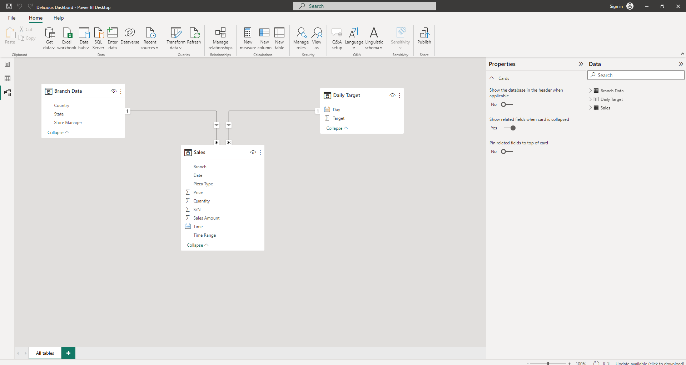
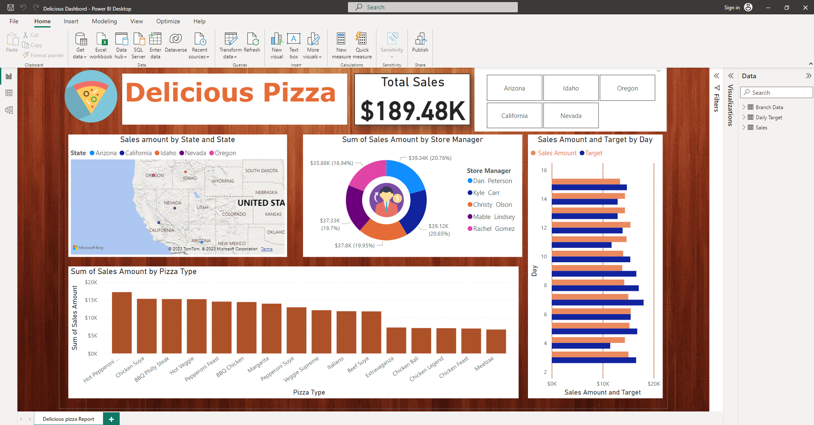

# Delicious-Pizza-Report

---

## Introduction

This is a Power BI project on a pizza franchise that sells different types of pizzas. This porject to analyze and derive insights to answer crucial questions help the francises to make data driven solutions.

**_Disclaimer_**: _All datasets and reports do not represent any company, institution or country, but just a dummy dataset to demonstrate capabilities of Power BI._ 

## Problem Statement 
1. How much each state is selling and what kind of pizza?
2. Total Sales per each state?
3. Total Sales by Pizza type?
4. Target Sales vs actual sales ?

## Skills/ concepts demonstrated
1. Custom column
2. Quick measures
3. Modelling

## Modelling

Automatically derived relationships are adjusted to remove and replace unwanted relatinships with the required.

The model is star schema.

## Visualization

## Conclusions

1. Nevada state has highest total number of sales.
2. Hot pepper pizza has highest number of sales.

